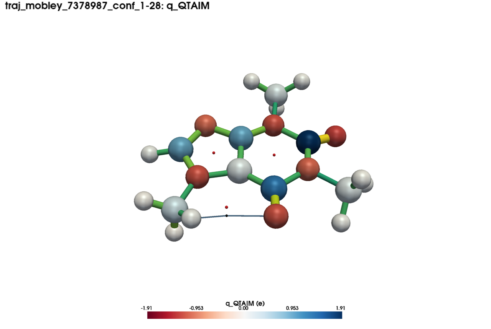
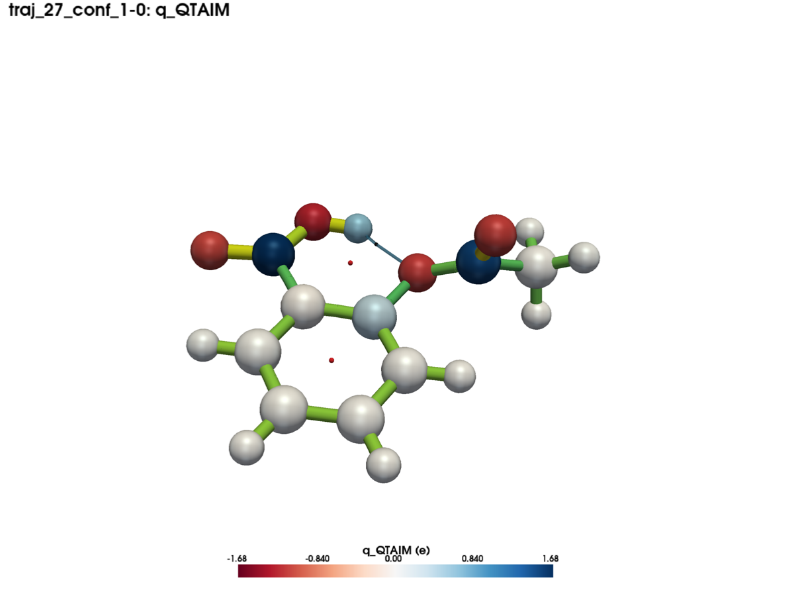
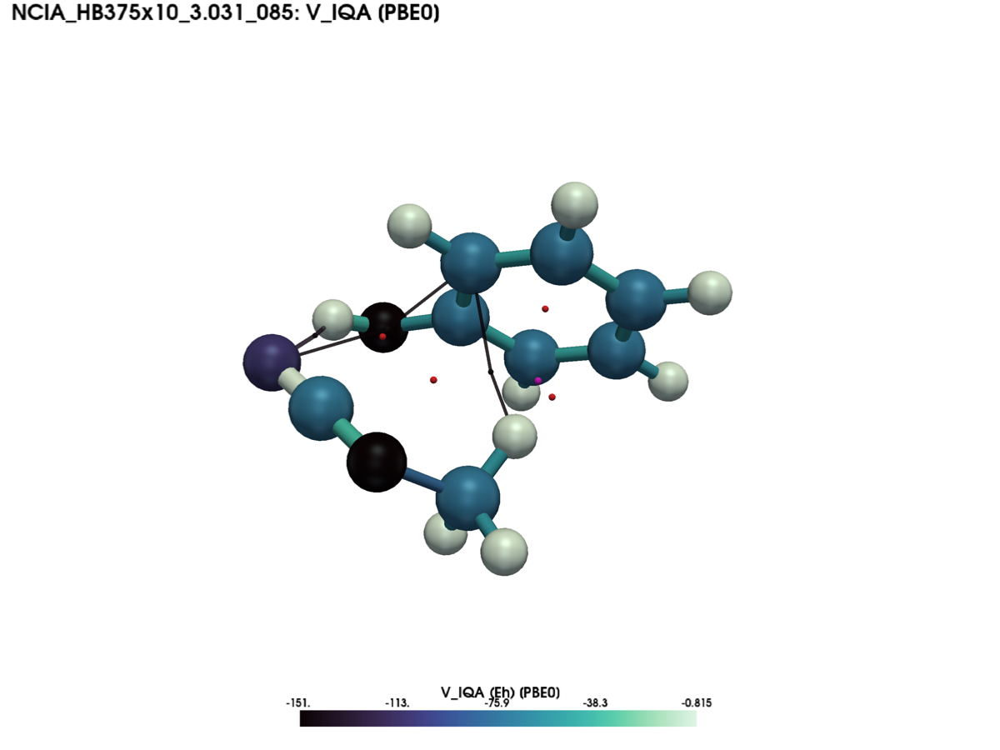
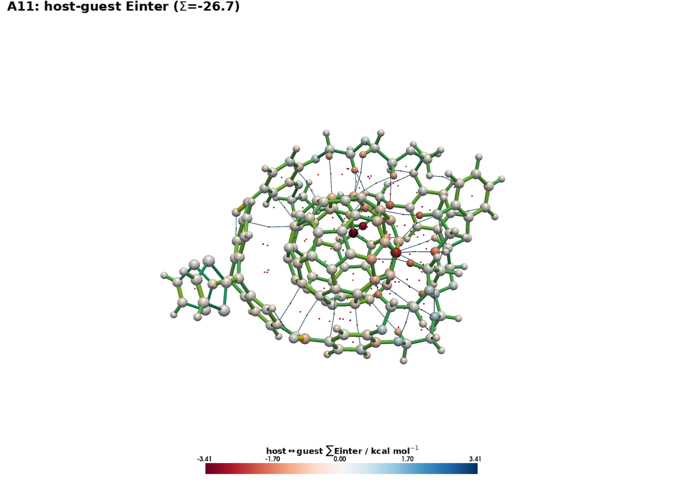

# IQARIS-Explorer

**An atlas of interacting quantum atoms across chemical space — a toolkit and interactive 3D explorer
for the IQARIS database.**


<div align="justify">

[**IQARIS**](https://doi.org/10.5281/zenodo.22177221) (Interacting Quantum Atoms Reference Information
Set) is a large-scale database of local quantum-chemical properties spanning CHONSFPCl chemical space:
**268,639** curated structures (178,257 unique connectivities), each annotated with a DFT-level QTAIM
analysis of the electron-density topology at two hybrid functionals (M06-2X and PBE0/def2-TZVP), a
genuine *ab initio* IQA energy decomposition (PBE0/def2-TZVP), and IQA energy decompositions at five
semiempirical levels (PM7, PM6, PM6-D3H4, PM6-D3H4X, PM6-ORG).

This repository holds the **IQARIS-Explorer**, an open-source Python toolkit — a command line *and* a
scriptable API — to explore, visualize, and export the released database for machine learning and
analysis. The database itself is distributed separately on [Zenodo](#get-the-data).

<p align="center">
  
</p>
<p align="justify">
  <em>Caffeine coloured by QTAIM atomic charge <code>q(&Omega;)</code>, with the molecular graph and ring
  critical points overlaid — one command in the IQARIS-Explorer viewer.</em>
</p>

> **Paper:** *IQARIS: An Atlas of Interacting Quantum Atoms across Chemical Space* (submitted). Please
> cite the paper and the Zenodo dataset if you use this software or the data.

---

## Contents

- [What you can do with it](#what-you-can-do-with-it)
- [Install](#install)
- [Get the data](#get-the-data)
- [Quickstart (5 minutes)](#quickstart-5-minutes)
- [Tutorial](#tutorial)
  - [1. Select & count structures](#1-select--count-structures)
  - [2. Discover properties](#2-discover-properties-list-props--info--glossary)
  - [3. Summaries & plots](#3-summaries--plots)
  - [4. Visualize in 3D](#4-visualize-in-3d)
  - [5. Export for machine learning](#5-export-for-machine-learning)
- [Python API](#python-api)
- [The database at a glance](#the-database-at-a-glance)
- [Data quality & layers](#data-quality--layers)
- [Validation](#validation)
- [Citation](#citation)
- [License](#license)

---

## What you can do with it

The toolkit reads the released Parquet/DuckDB tables **read-only** and lets you:

- **Explore & filter** the full 268,639-structure set by element, composition, source family, size,
  sanity tier, or arbitrary value predicates — with optional grouping by molecular identity.
- **Look up properties** against the built-in dictionary (`info`, `list-props`, `glossary`) — the same
  182-property dictionary documented in the paper's Supporting Information, with units and equations.
- **Summarize & plot** the distribution of any column (histograms, per-element violins, coverage).
- **Visualize in 3D** — project any atomic, bond, or critical-point property onto the structure at the
  chosen level of theory; overlay the QTAIM molecular graph, bond paths and interatomic surfaces; and
  colour host–guest complexes by their interfacial interaction.
- **Export** to common ML formats (extended XYZ, graph, tabular, ASE-db) with reproducible manifests.

Because the underlying calculations are single-point, **no atomic forces** are provided; exports pair
the per-structure energies (as training targets) with the per-atom, per-pair and per-critical-point
real-space labels.

---

## Install

Requires **Python ≥ 3.10**. Clone the repository — or download and unzip it from GitHub — then install
with `pip`:

```bash
cd iqaris-explorer
python -m pip install .                    # core: query + export to text/tabular
```

Optional feature sets ("extras"):

```bash
python -m pip install ".[viewer]"          # interactive 3D viewer (PyVista/VTK)
python -m pip install ".[qt]"              # native-Qt viewer panel (PySide6)
python -m pip install ".[export]"          # graph/HDF5 + ASE-db writers
python -m pip install ".[plots]"           # matplotlib/seaborn distribution plots
python -m pip install ".[all]"             # everything above
```

Or install straight from GitHub without cloning:

```bash
python -m pip install "git+https://github.com/m-gallegos/iqaris-explorer.git"
```

Core dependencies: `duckdb`, `numpy`, `pandas`. Installing puts an **`iqaris`** command on your `PATH`
— every example below can be run as `iqaris ...` instead of `python -m iqaris_export ...`. (Developers
who want an editable checkout can use `python -m pip install -e ".[all]"`.)

---

## Get the data

The IQARIS database is distributed on Zenodo (**DOI:** `10.5281/zenodo.22177221`). Download and unpack
it, then point the toolkit at the release directory:

```bash
export IQARIS_DB_ROOT=/path/to/iqaris_db          # or pass --root on any command
```

The release is a self-contained tree of Parquet tables plus its DuckDB view layer
(`iqaris_views.sql` and `make_catalog.py`). Run `python make_catalog.py` once inside the release
directory to build the `iqaris.duckdb` catalog (needs the `duckdb` package; if the file is absent the
toolkit falls back to the SQL views). The toolkit never writes into the release. That's all the setup
you need.

---

## Quickstart (5 minutes)

```bash
# how many structures survive the default curation?
iqaris count                                              # -> 268639

# list the ab initio IQA properties (PBE0 level, IQA analysis)
iqaris list-props --level pbe0 --analysis iqa

# describe one property (name, symbol, unit, type, method, equation)
iqaris info EINT_IQA

# summary statistics of a column over a selection
iqaris stats --column q_QTAIM --natoms 3:12

# render a structure coloured by QTAIM charge, with the molecular graph, to a PNG
iqaris project --sid dsgdb9nsd_070890 --prop q_QTAIM --graph --save charge.png

# export a graph dataset for drug-like molecules with the ab initio PBE0 labels
iqaris export --family mobley --level pbe0 --props all --format graph-npz --out mobley_pbe0
```

---

## Tutorial

Everything the toolkit exposes lives under nine subcommands:

```
count · explore · stats · list-props · info · glossary · plot · project · export
```

Run `iqaris --help` or `iqaris <command> --help` for the full option list of any of them.

### 1. Select & count structures

Every command shares the same **selection** flags, so you build a subset once and reuse it. `count`
is the fast way to see how large a selection is:

```bash
iqaris count                                     # whole clean release -> 268639
iqaris count --natoms 3:12                        # by size (inclusive atom-count range)
iqaris count --elements S,N                       # must contain ALL of these elements
iqaris count --elements-only C,H,O                # composition is a SUBSET of these
iqaris count --family qm9                          # by source family (qm9, gdb, mobley, ncia, ...)
iqaris count --formula "C6H6"                     # exact formula (or a LIKE pattern with %)
iqaris count --tier recommended                    # a curated quality tier
iqaris count --one-per-molecule                    # keep one conformer per molecular identity
```

**Value predicates** filter on the properties themselves — `"COLUMN OP VALUE [@LEVEL]"`, repeatable:

```bash
# QTAIM charges above 0.6 e, read at the PBE0 level
iqaris count --level pbe0 --predicate "q_QTAIM > 0.6"

# combine terms, each scoped to its own level of theory
iqaris count --predicate "q_QTAIM > 0.6 @M06-2X" --predicate "charge_resid < 1e-3 @PBE0"
```

A shared `*_QTAIM` property exists at **both** DFT levels, so an unscoped predicate binds to the
subcommand's `--level` (default M06-2X); append `@M06-2X`, `@PBE0`, or an SQM method (`@PM7`, …) to
scope one term explicitly. `iqaris explore` gives a fuller JSON summary (counts, coverage, tiers) of
the same selection.

### 2. Discover properties (`list-props` · `info` · `glossary`)

The catalogue has two orthogonal axes — the **level of theory** (`--level`) and the **analysis type**
(`--analysis`: `qtaim`, `iqa`, `iqa-sqm`):

```bash
iqaris list-props                                          # everything
iqaris list-props --level m062x --analysis qtaim          # QTAIM topology at M06-2X
iqaris list-props --level pbe0  --analysis iqa            # ab initio IQA energies at PBE0
iqaris list-props --level pm7   --analysis iqa-sqm        # semiempirical IQA
iqaris list-props --prop-family atomic --desc             # atomic properties, with descriptions
```

`info` prints the full dictionary entry for any property — name, symbol, **unit**, type, method and
formal equation — cross-checked against the paper's Supporting Information:

```console
$ iqaris info q_QTAIM
q_QTAIM   q(A)
────────────────────────────────────────────────────────────
Atomic charge
Unit   : e
Type   : Atomic
Method : M06-2X/def2-TZVP and PBE0/def2-TZVP (QTAIM density topology, gas phase)
Net electronic charge of an atom: its nuclear charge minus the electron
density integrated over the QTAIM atomic basin ΩA.
    q(A) = Z_A - ∫_ΩA ρ(r) dr
Views  : qtaim_m062x_atomic, qtaim_pbe0_atomic
```

`iqaris info EINT_IQA --no-db` answers from the shipped dictionary alone (no database needed), and
`iqaris glossary --format markdown|html|json --out FILE` renders the whole 182-property dictionary as
a standalone document.

### 3. Summaries & plots

```bash
iqaris stats --column q_QTAIM --level pbe0 --natoms 3:12          # min/max/mean/std as JSON
iqaris stats --column Einter_SQM --method PM7                     # a semiempirical column

iqaris plot --column q_QTAIM --kind hist   --out plots/          # histogram  (writes into a folder)
iqaris plot --column q_QTAIM --kind violin --out plots/          # per-element violin
iqaris plot --coverage --out plots/                              # data-coverage overview
```

(`plot` needs the `[plots]` extra; `--out` is a directory into which `<column>_<kind>.pdf`/`.png` are
written.)

### 4. Visualize in 3D

Project any atomic / bond / critical-point property onto the real structure. Add `--save FILE` for an
off-screen PNG (works headless) or `--interactive` for a live window:

```bash
# atomic charge + molecular graph, saved to a PNG
iqaris project --sid dsgdb9nsd_070890 --prop q_QTAIM --graph --save charge.png

# the ab initio PBE0 IQA potential, with a chosen colormap
iqaris project --sid G1 --prop V_IQA --level pbe0 --graph --cmap mako --save v_iqa.png

# a semiempirical property at a given method
iqaris project --sid G1 --prop q_SQM --method PM7 --save q_pm7.png

# overlay bond paths and interatomic surfaces
iqaris project --sid G1 --paths --save paths.png
iqaris project --sid G1 --prop AREA_QTAIM --ias --save ias.png

# host–guest complexes: colour each atom by its summed interface interaction
iqaris project --sid A11 --fragment --graph --save hostguest.png
```

<table>
  <tr>
    <td width="50%"></td>
    <td width="50%"></td>
  </tr>
  <tr>
    <td align="justify"><em>Molecular graph &amp; bond paths, including an intramolecular contact (ring critical points as red dots).</em></td>
    <td align="justify"><em>Ab&nbsp;initio IQA potential at PBE0 (<code>V_IQA</code>), sequential colormap; the <code>[PBE0]</code> tag marks the level.</em></td>
  </tr>
</table>

<p align="center">
  
</p>
<p align="justify">
  <em>The 226-atom "buckyball-catcher" host–guest complex with its QTAIM molecular graph, each atom
  coloured by its summed host&nbsp;↔&nbsp;guest interaction energy (&Sigma; = &minus;26.7&nbsp;kcal&nbsp;mol⁻¹).</em>
</p>

Two interchangeable viewer backends render the same scene:

- **default** — a self-contained PyVista/VTK window (needs the `[viewer]` extra + OpenGL);
- **Qt panel** — set `IQARIS_VIEWER=qt` for a native side panel with a searchable structure picker
  (needs the `[qt]` extra, plus `libxcb-cursor0` on Linux).

Any property can be projected at the M06-2X QTAIM level, the *ab initio* PBE0 QTAIM/IQA level, or any
of the five semiempirical IQA methods; when no display is available, `--save FILE` renders off-screen.

### 5. Export for machine learning

```bash
# extended XYZ (ASE-readable), all PBE0 labels, for a source family
iqaris export --family mobley --level pbe0 --props all --format extxyz --out mobley

# a graph dataset (NPZ or HDF5)
iqaris export --natoms 3:20 --level pbe0 --props all --format graph-npz --out graphs

# tabular (one CSV/Parquet per family)
iqaris export --props atomic,charges --level PM7 --format csv --out tables

# an ASE database
iqaris export --props atomic --level pbe0 --format ase-db --out ase
```

| format | flag(s) | notes |
|---|---|---|
| Extended XYZ | `extxyz` | per-structure energy on the comment line (Hartree; `energy_unit=Eh`) |
| Graph | `graph-npz`, `graph-hdf5` | nodes = atoms (+ optional CP auxiliary nodes), edges = bonds |
| Tabular | `csv`, `parquet` | one file per family (molecular / atomic / pairs / …) |
| ASE database | `ase-db` | needs the `[export]` extra; energy stored on each row |

Useful `export` options: `--props` accepts family shorthands (`molecular`, `atomic`, `pairs`, `cp`,
`angles`), named bundles (`charges`, `iqa`, `esp`, `topology`, `multipoles`, `energies`), `all`, or an
explicit comma-separated column list; `--energy-target` chooses the training energy (default
`E_PBE0_Eh`); `--include-problematic` adds the quality-flagged PBE0 records and a `pbe0_qc_status`
column. Every export also writes a **`manifest.json`** (the exact selection) and **`columns.json`**
(per-column family, unit and source view) so a dataset is fully reproducible.

---

## Python API

Everything the CLI does is available as a library:

```python
import iqaris_export as ie
from iqaris_export import Selection, Predicate
from iqaris_export.db import filter_ids, molecule_groups

con = ie.connect()                       # read-only DuckDB connection to the release

# small molecules carrying a strongly positive QTAIM charge, at the PBE0 level
sel = Selection(natoms=(3, 12), predicates=(Predicate("q_QTAIM", ">", 0.6),), level="pbe0")
ids = sel.resolve(con)                              # sorted structure_id list

# export that selection with the ab initio PBE0 labels to extended XYZ
ie.export(con, sel, props="atomic,charges", level="pbe0", fmt="extxyz", out="pbe0")

print(ie.info("EINT_IQA"))                          # dictionary entry as text
ok = filter_ids(method="PBE0", iqa_closure_resid_kj=1.0, con=con)   # granular sanity filter
groups = molecule_groups(key="inchikey_block1", con=con)           # molecule key -> its structure_ids

ie.view("A11", con=con, fragment=True)   # open a 3D window (needs a display)
```

---

## The database at a glance

| | |
|---|---|
| **Structures** | 268,639 curated geometries (178,257 unique connectivities) |
| **Elements** | C, H, O, N, S, F, P, Cl |
| **QTAIM topology** | at **M06-2X** and **PBE0** (both def2-TZVP), gas phase |
| **Ab initio IQA** | energy decomposition at **PBE0**/def2-TZVP |
| **IQA-SQM** | energy decomposition at **PM7, PM6, PM6-D3H4, PM6-D3H4X, PM6-ORG** |
| **Properties** | **182** documented keys — 94 QTAIM · 46 IQA · 42 IQA-SQM |
| **Families** | molecular · atomic · interatomic-pair · critical-point · bond-path-angle |

Level names used across the toolkit: `m062x` (alias `dft`) and `pbe0` for the DFT records; `PM7`,
`PM6`, `PM6-D3H4`, `PM6-D3H4X`, `PM6-ORG` for the semiempirical ones.

---

## Data quality & layers

- **Clean by default.** The toolkit serves only the clean release. Quality-flagged PBE0 records are
  exposed *on request* through `export --include-problematic`, which adds a `pbe0_qc_status` column.
- **Sanity tiers** (`--tier`): `sane_qtaim`, `sane_mopac_all5`, `sane_all`, `recommended`.
- **Granular sanity filter** (`filter_ids` / value predicates) exposes the per-structure QC residuals
  (charge closure, IQA closure, …) so you can set your own thresholds.

## Validation

The released database was validated before publication along three independent legs — full-database
physical/algebraic invariants (no sampling), reproduction from the primary quantum-chemistry outputs,
and an independent re-parser cross-check — all passing with zero blocking failures. The validation
protocol and the data-quality policy are described in the paper and its Supporting Information.

## Citation

If you use this software or the IQARIS data, please cite the paper and the Zenodo dataset:

> M. Gallegos, J. M. Guevara-Vela, A. Tkatchenko. *IQARIS: An Atlas of Interacting Quantum Atoms
> across Chemical Space* (submitted). Dataset: [`10.5281/zenodo.22177221`](https://doi.org/10.5281/zenodo.22177221).

## License

**MIT** — see [`LICENSE`](LICENSE). The IQARIS **dataset** on Zenodo is distributed separately under
**Creative Commons Attribution 4.0** (CC BY 4.0).

</div>
